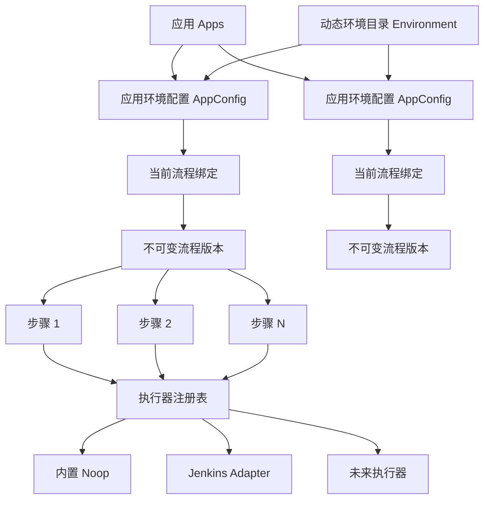
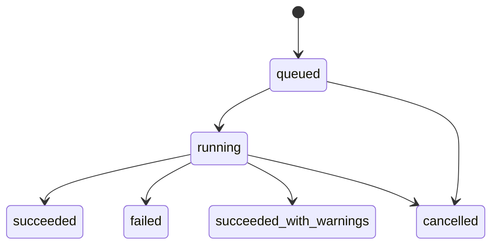

# 可插拔 CI/CD 与动态环境架构

## 1. 背景

Ares 的历史实现围绕应用管理发布，但发布链路把“流水线”等同于 Jenkins 的一组固定 CI/CD Job，把发布环境等同于 `dev`、`test`、`moni` 三个枚举。该模型能支撑既有场景，却会产生以下限制：

- 未配置 Jenkins 时无法创建任何发布任务，核心业务依赖具体执行平台。
- 一个包类型只能绑定“构建 + 部署”两个固定步骤，无法按需插入测试、扫描、审批或通知。
- 后端校验、Kubernetes 客户端和前端组件分别写死三个环境，自定义环境会被拒绝或丢弃。
- 环境名称隐含发布行为，例如 `moni` 绑定特殊分支规则，环境身份与流程规则相互污染。
- 任务记录只保存 CI/CD 两组 Jenkins Job 和 Build Number，不能表达任意数量的步骤。

本设计保留“应用是核心、一个应用拥有多个环境配置”的领域主轴，并把发布流程绑定到具体的应用环境配置。

## 2. 目标与非目标

### 2.1 目标

1. Ares 核心只负责编排，Jenkins 变为可选的步骤执行器。
2. 流水线由有序步骤组成，步骤可以新增、删除、排序和按应用环境独立配置。
3. 环境由数据库目录管理，不对名称和数量做业务枚举限制。
4. 新安装在不配置 Jenkins、Kubernetes、Redis 或 RabbitMQ 时仍能管理应用、配置流程并运行 Demo 流程。
5. 现有数据和接口可以渐进迁移，升级期间不重复触发外部任务。
6. 状态编排具备持久化、幂等和多实例安全的演进基础。

### 2.2 首版非目标

- 不实现 DAG、并行矩阵、循环和动态 fan-out，首版采用串行步骤。
- 不允许在 Ares 进程内执行任意 Shell，避免把 Web 服务变成远程命令执行入口。
- 不使用 Go `.so` 动态插件；执行器通过编译期注册表扩展。
- 不强制引入 Redis 或 RabbitMQ。首版以 MySQL 为事实源和调度队列，同时保留替换调度器的边界。
- 不删除 `pipelines`、`pipelines_job_combination` 和 `task_record` 的旧 CI/CD 字段。
- 不在首版同时适配所有 CI 平台；首批提供 `builtin.noop@v1` 和 `jenkins.job@v1`。

## 3. 领域模型



发布资格定义为：

> 环境已启用 ∩ 应用存在该环境的 AppConfig ∩ AppConfig 已绑定有效流程版本 ∩ 流程中所需执行器当前可用。

环境代码只表示业务环境身份，不再决定分支、构建参数或发布策略。Git ref/branch 是一次发布的独立输入；不同环境的特殊行为放入其流程步骤配置。

## 4. 环境目录

首版演进现有 `env_configs` 表，避免同时维护两套环境身份：

- `env`：不可变环境代码，写入时 trim、转小写，格式为 `^[a-z][a-z0-9._-]{0,62}$`。
- `description_cn`：展示名称。
- `enabled`：是否允许创建新应用配置及发起新发布。
- `sort_order`：前端展示顺序。
- `cluster_name`、`harbor_*`、`node_version`、`maven_version`：保留为兼容字段，改为可空；新领域逻辑不得把它们当作环境身份必填项。

删除采用停用语义。已经被应用配置或历史任务引用的环境不能物理删除；停用环境仍可在历史详情中显示。

应用创建后不再自动生成三个固定配置。用户从启用的环境目录中按需添加 AppConfig。Demo 数据仍可提供 `dev`、`test`、`moni`，并额外提供非旧枚举环境来证明环境是数据而非代码常量。

Kubernetes 集成按环境代码动态建立运行时客户端映射，不预分配三个固定槽位。环境目录本身不要求 Kubernetes 已配置。

## 5. 流程定义与版本

一个 AppConfig 绑定一个当前流程版本。流程编辑采用“创建新版本并切换绑定”的方式，已发布版本不可变，保证运行中任务和历史记录可重现。

首版流程规范示例：

```json
{
  "schema_version": 1,
  "name": "Go 服务发布",
  "steps": [
    {
      "key": "build",
      "name": "构建镜像",
      "uses": "jenkins.job@v1",
      "category": "build",
      "with": {
        "job": "demo-go-ci",
        "parameters": {}
      },
      "timeout_seconds": 3600,
      "on_failure": "stop"
    },
    {
      "key": "smoke",
      "name": "冒烟检查",
      "uses": "builtin.noop@v1",
      "category": "verify",
      "with": {"message": "demo passed"},
      "on_failure": "stop"
    }
  ]
}
```

约束：

- `schema_version` 用于规范演进。
- `key` 在一个版本内唯一且稳定。
- `uses` 使用 `类型@版本` 精确寻址，避免执行器升级破坏旧任务恢复。
- `on_failure` 首版支持 `stop` 和 `continue`。
- 同一个任务同时最多运行一个步骤。
- 配置中只保存 Secret 引用，不保存明文 Secret；运行快照和 API 响应必须脱敏。
- 首版模板替换只允许白名单上下文，不支持执行任意表达式。

数据表职责：

| 表 | 职责 |
| --- | --- |
| `release_workflows` | 流程身份和说明 |
| `release_workflow_versions` | 不可变规范、版本、校验和、审计信息 |
| `app_config_workflows` | AppConfig 到当前版本的原子绑定 |
| `task_record` | 发布运行主记录和兼容字段 |
| `task_step_records` | 任务的步骤快照、当前状态和外部引用 |

`task_record` 保留旧 `ci_*`、`cd_*` 字段用于兼容查询，但通用步骤记录是新引擎的事实源。

## 6. 执行器边界

核心编排只依赖以下能力：

```go
type Executor interface {
    Descriptor() Descriptor
    Validate(config json.RawMessage) error
    Start(ctx context.Context, request StartRequest) (Result, error)
    Reconcile(ctx context.Context, request ReconcileRequest) (Result, error)
}
```

`Result` 使用统一状态：`running`、`succeeded`、`failed`、`cancelled`、`unknown`。外部运行引用是 opaque JSON，不假设为整数 Build Number。日志和取消作为可选能力暴露：

```go
type LogReader interface { ReadLogs(context.Context, LogRequest) (LogChunk, error) }
type Canceller interface { Cancel(context.Context, CancelRequest) error }
```

注册表在进程启动时按 `uses` 注册执行器，重复注册失败。保存流程时校验结构、步骤类型和步骤配置；发起发布时再校验执行器运行可用性：

- 步骤类型存在；
- 步骤配置合法；
- 必需的外部集成可用（仅发布时）。

未配置 Jenkins 时仍可预先保存包含 `jenkins.job@v1` 的流程，但该流程不可发起运行；其他功能不受影响。`builtin.noop@v1` 为同步、安全且无外部依赖的 Demo/测试执行器。

## 7. 运行状态与可靠性



步骤状态为：

```text
pending -> running -> succeeded
                   -> failed
                   -> cancelled
```

后续版本可在不改变流程规范的情况下增加 `retry_wait`、`timed_out` 和人工 `waiting`。

任务创建时在一个数据库事务中保存流程规范、发布上下文和所有步骤快照。Worker 使用条件更新/CAS 认领待执行步骤；不得依赖“最近三小时”窗口。跨数据库与外部系统无法获得真正 exactly-once，执行器必须收到稳定幂等键：

```text
task_id / step_key / attempt
```

Jenkins Adapter 将其作为构建参数传递。取得 Queue ID 后立即持久化并交给后续协调；如果触发请求在取得 Queue ID 前结果不明确，首版无法跨系统证明 exactly-once，后续需结合 Jenkins 侧按幂等键查询或新的发布 API 去重能力继续完善。

## 8. API 边界

首版新增：

- `GET /api/v1/environments`：公开读取完整环境目录（包含停用项，供历史记录显示）。
- `POST /api/v1/system/environments`：创建环境。
- `PATCH /api/v1/system/environments/:code`：修改名称、启停和排序。
- `GET /api/v1/pipeline-step-types`：读取可用步骤描述符。
- `GET /api/v1/app-configs/:config_id/workflow`：使用系统管理员令牌读取当前流程。
- `PUT /api/v1/app-configs/:config_id/workflow`：使用系统管理员令牌校验规范、创建不可变版本并切换绑定。
- `GET /api/v1/deploy/publish/query/:task_id/steps`：读取通用步骤运行记录。

现有发布接口保留，内部切换到通用 Release/Workflow 服务。后续新增以 `config_id` 和 `Idempotency-Key` 为主的新发布 API，旧 `app_name + env` DTO 作为兼容适配层。

## 9. 兼容与迁移

采用 expand → 切换读写 → contract：

1. 扩展 `env_configs` 和工作流/步骤表，不删除旧列。
2. 从 `env_configs`、`app_configs`、`task_record` 的环境并集补齐目录；新环境默认禁用，管理员确认后启用。
3. 将旧 `pipelines_job_combination` 导入为两个 `jenkins.job@v1` 步骤的流程，并按包类型为 AppConfig 建绑定。
4. 新任务写通用步骤记录；恰好匹配旧 CI/CD 的 Jenkins 流程可投影旧字段供旧前端读取。
5. 升级时不迁移、不重触发在途旧任务，新任务进入新引擎。旧 schema 未保存 Jenkins 地址，无法证明实例归属的 v1 在途任务必须在网络调用前 fail-closed；只有显式绑定且与当前运行时一致的任务才允许旧引擎收尾。
6. 观察至少一个大版本后，才评估移除旧表、旧字段和旧日志接口。

结构迁移采用前向兼容策略，但升级后的数据库不能由旧版 Xorm 进程继续写入。旧同步逻辑会删除它不认识的新索引，却保留迁移版本标记；因此回退必须使用 schema/Worker 兼容镜像，或恢复升级前数据库备份，不能只替换为旧二进制。

历史环境重复或大小写碰撞必须在加唯一约束前报告并停止迁移，不得静默合并。`ceshi -> test` 等别名不得继续存在于核心发布逻辑；如确需兼容，只能放在带弃用告警的兼容 API 层。

## 10. 安全约束

- 执行器配置严格校验，未知字段按步骤规范处理。
- 不提供任意 Shell 步骤。
- 完整通用日志接口上线时必须通过 `task_id + step_key` 定位并纳入鉴权，客户端不能任意指定 Jenkins Job；本阶段只提供脱敏的通用步骤详情，旧 Jenkins 日志接口仍属于待迁移兼容面。
- Secret 只保留引用，数据库快照、日志、错误消息和接口响应不得回传明文。
- 管理环境和流程沿用系统管理鉴权；发布权限后续纳入细粒度 RBAC。
- 批量发布采用有界并发，不创建无上限 goroutine。
- Jenkins 步骤的外部引用绑定实例地址；已绑定的在途 v1/v2 任务存在时禁止换址，运行时切换与步骤 Start/Reconcile 通过读写门闩串行化。历史未绑定 v1 任务不猜测归属、不访问 Jenkins，并进入明确失败终态。

## 11. 架构验收

- 添加 `qa-cn` 后，无需改代码即可创建应用配置、配置独立流程并发布。
- 同一应用的 `dev` 和 `prod-blue` 可以拥有不同数量、不同类型和不同顺序的步骤。
- 不配置 Jenkins 时，服务健康、环境/流程 API 可用，Noop Demo 可完整成功。
- 一个包含三个以上步骤的任务能逐步推进、失败即停，并正确返回每步状态。
- 两个 Worker 同时扫描时，一个步骤只被一个 Worker 认领。
- 修改流程后，已开始和历史任务仍展示原始步骤快照。
- 旧终态任务和旧 CI/CD 字段仍可查询。
