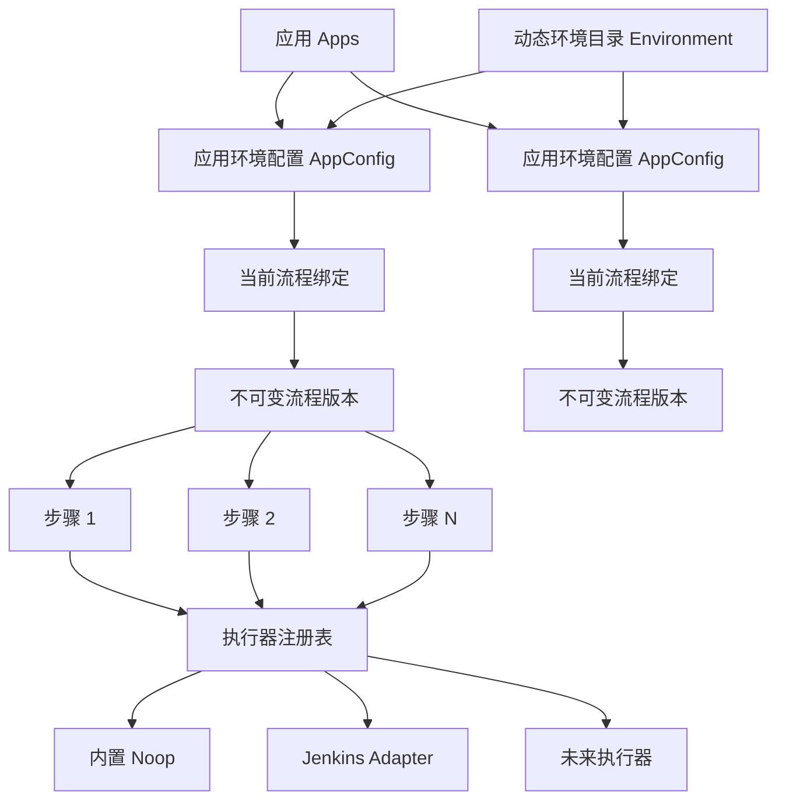
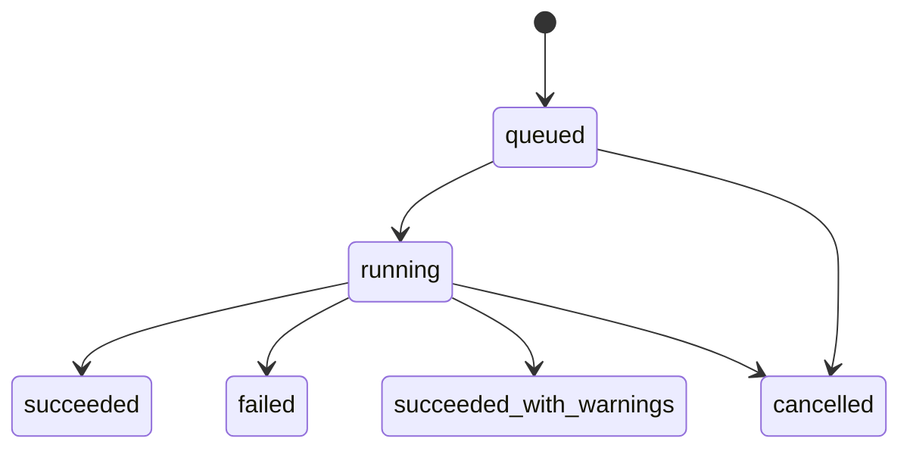

# 可插拔 CI/CD 与动态环境架构

## 1. 背景

Ares 的历史实现围绕应用管理发布，但发布链路把“流水线”等同于 Jenkins 的一组固定 CI/CD Job，把发布环境等同于 `dev`、`test`、`moni` 三个枚举。该模型能支撑既有场景，却会产生以下限制：

- 未配置 Jenkins 时无法创建任何发布任务，核心业务依赖具体执行平台。
- 一个包类型只能绑定“构建 + 部署”两个固定步骤，无法按需插入测试、扫描、审批或通知。
- 后端校验、Kubernetes 客户端和前端组件分别写死三个环境，自定义环境会被拒绝或丢弃。
- 环境名称隐含发布行为，例如 `moni` 绑定特殊分支规则，环境身份与流程规则相互污染。
- 任务记录只保存 CI/CD 两组 Jenkins Job 和 Build Number，不能表达任意数量的步骤。

本设计保留“应用是核心、一个应用拥有多个环境配置”的领域主轴，并把发布流程绑定到具体的应用环境配置。
发布命令的一致性与重试协议由
[ADR-0004：以 AppConfig 为目标的原子幂等发布](decisions/0004-appconfig-idempotent-releases.md)
固定。

## 2. 目标与非目标

### 2.1 目标

1. Ares 核心只负责编排，Jenkins 变为可选的步骤执行器。
2. 流水线由有序步骤组成，步骤可以新增、删除、排序和按应用环境独立配置。
3. 环境由数据库目录管理，不对名称和数量做业务枚举限制。
4. 新安装在不配置 Jenkins、Kubernetes、Redis 或 RabbitMQ 时仍能管理应用、配置流程并运行 Demo 流程。
5. 现有数据和接口可以渐进迁移，升级期间不重复触发外部任务。
6. 状态编排具备持久化、幂等和多实例安全的演进基础。

### 2.2 首版非目标

- 不实现 DAG、并行矩阵、循环和动态 fan-out，首版采用串行步骤。
- 不允许在 Ares 进程内执行任意 Shell，避免把 Web 服务变成远程命令执行入口。
- 不使用 Go `.so` 动态插件；执行器通过编译期注册表扩展。
- 不强制引入 Redis 或 RabbitMQ。首版以 MySQL 为事实源和调度队列，同时保留替换调度器的边界。
- 不删除 `pipelines`、`pipelines_job_combination` 和 `task_record` 的旧 CI/CD 字段。
- 不在首版同时适配所有 CI 平台；首批提供 `builtin.noop@v1` 和 `jenkins.job@v1`。

## 3. 领域模型



发布资格定义为：

> 环境已启用 ∩ 应用存在该环境的 AppConfig ∩ AppConfig 已绑定有效流程版本 ∩ 流程中所需执行器当前可用。

环境代码只表示业务环境身份，不再决定分支、构建参数或发布策略。Git ref/branch 是一次发布的独立输入；不同环境的特殊行为放入其流程步骤配置。

## 4. 环境目录

首版演进现有 `env_configs` 表，避免同时维护两套环境身份：

- `env`：不可变环境代码，写入时 trim、转小写，格式为 `^[a-z][a-z0-9._-]{0,62}$`。
- `description_cn`：展示名称。
- `enabled`：是否允许创建新应用配置及发起新发布。
- `sort_order`：前端展示顺序。
- `cluster_name`、`harbor_*`、`node_version`、`maven_version`：保留为兼容字段，改为可空；新领域逻辑不得把它们当作环境身份必填项。

删除采用停用语义。已经被应用配置或历史任务引用的环境不能物理删除；停用环境仍可在历史详情中显示。

应用创建后不再自动生成三个固定配置。用户从启用的环境目录中按需添加 AppConfig。Demo 数据仍可提供 `dev`、`test`、`moni`，并额外提供非旧枚举环境来证明环境是数据而非代码常量。

Kubernetes 集成按环境代码动态建立运行时客户端映射，不预分配三个固定槽位。环境目录本身不要求 Kubernetes 已配置。

## 5. 流程定义与版本

一个 AppConfig 绑定一个当前流程版本。流程编辑采用“创建新版本并切换绑定”的方式，已发布版本不可变，保证运行中任务和历史记录可重现。

首版流程规范示例：

```json
{
  "schema_version": 1,
  "name": "Go 服务发布",
  "steps": [
    {
      "key": "build",
      "name": "构建镜像",
      "uses": "jenkins.job@v1",
      "category": "build",
      "with": {
        "job": "demo-go-ci",
        "parameters": {}
      },
      "timeout_seconds": 3600,
      "on_failure": "stop"
    },
    {
      "key": "smoke",
      "name": "冒烟检查",
      "uses": "builtin.noop@v1",
      "category": "verify",
      "with": {"message": "demo passed"},
      "on_failure": "stop"
    }
  ]
}
```

约束：

- `schema_version` 用于规范演进。
- `key` 在一个版本内唯一且稳定。
- `uses` 使用 `类型@版本` 精确寻址，避免执行器升级破坏旧任务恢复。
- `on_failure` 首版支持 `stop` 和 `continue`。
- 同一个任务同时最多运行一个步骤。
- 配置中只保存 Secret 引用，不保存明文 Secret；运行快照和 API 响应必须脱敏。
- 首版模板替换只允许白名单上下文，不支持执行任意表达式。

数据表职责：

| 表 | 职责 |
| --- | --- |
| `release_workflows` | 流程身份和说明 |
| `release_workflow_versions` | 不可变规范、版本、校验和、审计信息 |
| `app_config_workflows` | AppConfig 到当前版本的原子绑定 |
| `task_record` | 发布运行主记录和兼容字段 |
| `task_step_records` | 任务的步骤快照、当前状态和外部引用 |
| `release_idempotency_records` | 按服务端主体和语义操作保存发布命令摘要 |
| `release_idempotency_items` | 按原请求顺序保存任务或稳定业务失败结果 |

`task_record` 保留旧 `ci_*`、`cd_*` 字段用于兼容查询，但通用步骤记录是新引擎的事实源。W05
新增的 `app_config_id` 是新任务的稳定目标，历史任务允许为空；应用名、环境名仍作为运行快照展示，
不能再用于 canonical 创建定位。

## 6. 执行器边界

核心编排只依赖以下能力：

```go
type Executor interface {
    Descriptor() Descriptor
    Validate(config json.RawMessage) error
    Start(ctx context.Context, request StartRequest) (Result, error)
    Reconcile(ctx context.Context, request ReconcileRequest) (Result, error)
}
```

`Result` 使用统一状态：`running`、`succeeded`、`failed`、`cancelled`、`unknown`。外部运行引用是 opaque JSON，不假设为整数 Build Number。日志和取消作为可选能力暴露：

```go
type LogReader interface { ReadLogs(context.Context, LogRequest) (LogChunk, error) }
type Canceller interface { Cancel(context.Context, CancelRequest) error }
```

日志能力的完整协议由
[ADR-0003：执行器通用步骤日志与游标续传](decisions/0003-generic-step-logs.md) 固定。通用层只用
`task_id + step_key` 读取步骤快照并按其中的 `uses` 分派；执行器独占 opaque external reference
和 cursor 的解释权。descriptor 声明 `capabilities.logs=true` 时必须实现 `LogReader`，否则注册
失败。日志流的认证、会话复验和 HTTP 期限沿用
[ADR-0002](decisions/0002-authentication-rbac-audit.md)。

注册表在进程启动时按 `uses` 注册执行器，重复注册失败。保存流程时校验结构、步骤类型和步骤配置；发起发布时再校验执行器运行可用性：

- 步骤类型存在；
- 步骤配置合法；
- 必需的外部集成可用（仅发布时）。

未配置 Jenkins 时仍可预先保存包含 `jenkins.job@v1` 的流程，但该流程不可发起运行；其他功能不受影响。`builtin.noop@v1` 为同步、安全且无外部依赖的 Demo/测试执行器。

## 7. 运行状态与可靠性



步骤状态为：

```text
pending -> running -> succeeded
                   -> failed
                   -> cancelled
```

后续版本可在不改变流程规范的情况下增加 `retry_wait`、`timed_out` 和人工 `waiting`。

Canonical 发布以 `config_id` 定位目标。任务创建时在一个数据库事务中锁定并重新校验 AppConfig、
应用、环境、域名和当前工作流，把客户端请求摘要、任务、发布上下文、所有步骤快照及有序结果一起
提交。单发重试只重放已提交任务；批量的全部成功任务和业务失败项也形成一个原子 receipt，不再由
多个 goroutine 分别提交。Worker 使用条件更新/CAS 认领待执行步骤；不得依赖“最近三小时”窗口。

客户端创建 key 的唯一作用域是稳定用户 ID、版本化语义操作与 key SHA-256 摘要。请求摘要覆盖
`config_id/ref/inputs/expected_workflow_version_id`，使用保留精确 JSON 数值的规范化编码；时间戳、
镜像名和可变配置快照不能参与摘要。W05 永久保留只增 receipt，不自动清理。同 key、同摘要跨
进程/重启重放原结果，同 key、不同摘要失败关闭。

跨数据库与外部系统无法获得真正 exactly-once，执行器必须收到稳定幂等键：

```text
task_id / step_key / attempt
```

Jenkins Adapter 将它作为构建参数传递。客户端 `Idempotency-Key` 只用于 Ares 创建命令，绝不能
替代或透传这个执行器键。取得 Queue ID 后立即持久化并交给后续协调；如果触发请求在取得 Queue ID
前结果不明确，Ares 的 HTTP 创建去重并不能独自证明外部系统 exactly-once，仍需 Jenkins 侧按
`task_id/step_key/attempt` 查询或对账。

## 8. API 边界

当前稳定接口包括：

- `GET /api/v1/environments`：已认证用户读取完整环境目录（包含停用项，供历史记录显示）。
- `POST /api/v1/system/environments`：拥有环境写权限的管理员创建环境。
- `PATCH /api/v1/system/environments/:code`：拥有环境写权限的管理员修改名称、启停和排序。
- `GET /api/v1/pipeline-step-types`：拥有工作流读权限的用户读取步骤描述符。
- `GET /api/v1/app-configs/:config_id/workflow`：拥有工作流读权限的用户读取当前流程；没有写权限时执行器私有配置被脱敏。
- `PUT /api/v1/app-configs/:config_id/workflow`：拥有工作流写权限的管理员校验规范、创建不可变版本并切换绑定；Cookie 写请求同时校验 CSRF。
- `GET /api/v1/releases/targets`：按动态环境分页返回应用与 AppConfig 发布资格投影，供统一发布器选择目标。
- `POST /api/v1/app-configs/:config_id/releases/preflight`：按稳定 AppConfig 目标预检公开发布资格，不写任务或幂等记录。
- `POST /api/v1/app-configs/:config_id/releases`：以 `ref/inputs/expected_workflow_version_id` 和必需的项目级 `Idempotency-Key` 原子创建单个任务。
- `POST /api/v1/releases/batch/preflight`：按输入顺序逐项预检 1～100 个不重复 AppConfig。
- `POST /api/v1/releases/batch`：以一个必需 key 原子提交整个有序批次及结果。
- `GET /api/v1/deploy/publish/query/:task_id/steps`：拥有任务读权限的用户读取通用步骤运行记录及服务端派生的 capabilities。
- `GET /api/v1/tasks/:task_id/steps/:step_key/logs/stream`：拥有日志读权限的用户按任务步骤读取通用 SSE 日志；唯一 query 字段是可选 cursor。

完整请求、重放、结果和错误契约见 [AppConfig 发布 API](../development/release-api.md)。项目级 key
使用单一未加引号 ASCII token，长度 16～128 bytes，匹配
`[A-Za-z0-9][A-Za-z0-9._~-]*`；本项目不宣称遵循尚未成为正式标准或已经过期的外部草案。

旧 `/api/v1/deploy/publish` 与 `/api/v1/deploy/publish/batch` 保留一个发布版本。adapter 映射
`branch/extra_data` 后调用相同领域服务；带 key 的重放优先使用已有 receipt 的有序 `config_id` 校验
历史 `app_name + env` alias，首次请求才解析活动 alias，并在解析后复查 receipt、最终由 canonical
唯一键竞争收敛。缺 key 时明确保持非幂等兼容。这个无新 schema 的边界依赖 app name 及 AppConfig
环境/归属不可变且只做软删除；改变这些约束前必须引入版本化 alias snapshot。Web 不调用或 fallback
到旧接口。

## 9. 兼容与迁移

采用 expand → 切换读写 → contract：

1. 扩展 `env_configs` 和工作流/步骤表，不删除旧列。
2. 从 `env_configs`、`app_configs`、`task_record` 的环境并集补齐目录；新环境默认禁用，管理员确认后启用。
3. 将旧 `pipelines_job_combination` 导入为两个 `jenkins.job@v1` 步骤的流程，并按包类型为 AppConfig 建绑定。
4. 新任务写通用步骤记录；恰好匹配旧 CI/CD 的 Jenkins 流程仍可投影旧字段供历史查询兼容，但 W03 起的 Web 日志入口不再读取这些字段。
5. 升级时不迁移、不重触发在途旧任务，新任务进入新引擎。旧 schema 未保存 Jenkins 地址，无法证明实例归属的 v1 在途任务必须在网络调用前 fail-closed；只有显式绑定且与当前运行时一致的任务才允许旧引擎收尾。
6. W03 将旧 Jenkins 日志接口收紧为只读 v1 历史任务并标记 deprecated；v2 任务只使用通用步骤日志。观察至少一个大版本后，才评估移除旧表、旧字段和 v1 日志接口。
7. Epoch 6 为 `task_record` 扩展可空 `app_config_id`，不猜测回填历史任务；新增两张只增幂等表，
   不从旧请求或任务推导 receipt。
8. W05 后所有 canonical 任务写稳定目标和原子 receipt；旧发布接口只在 adapter 层保留一个版本。

结构迁移采用前向兼容策略，但升级后的数据库不能由旧版 Xorm 进程继续写入。旧同步逻辑会删除它不认识的新索引，却保留迁移版本标记；因此回退必须使用 schema/Worker 兼容镜像，或恢复升级前数据库备份，不能只替换为旧二进制。

历史环境重复或大小写碰撞必须在加唯一约束前报告并停止迁移，不得静默合并。`ceshi -> test` 等别名不得继续存在于核心发布逻辑；如确需兼容，只能放在带弃用告警的兼容 API 层。

## 10. 安全约束

- 执行器配置严格校验，未知字段按步骤规范处理。
- 不提供任意 Shell 步骤。
- 通用日志只通过 `task_id + step_key` 定位并纳入 `logs.read` 鉴权；客户端不能指定执行器、external reference、Jenkins Job、Build ID 或地址。服务端先验证步骤归属、能力和实例绑定，再允许执行器外连。
- SSE 只暴露有界日志文本和 opaque cursor；cursor、日志正文、external reference 与上游错误不进入审计。会话撤销后流关闭，页面关闭或切换任务/步骤必须取消上游 context。
- Secret 只保留引用，数据库快照、日志、错误消息和接口响应不得回传明文。
- 环境、流程、发布、任务和日志均使用 ADR-0002 的服务端细粒度 RBAC；前端按钮和 capabilities 只用于体验，不是授权边界。
- `Idempotency-Key` 原文、key/request digest 和 inputs 不进入日志、审计、响应或执行器；发布人和幂等作用域只来自服务端 `Principal`。
- 批量发布最多 100 个不重复目标、2000 个步骤快照，在单个有界数据库事务中按稳定锁顺序创建；HTTP 事务不并发调用执行器。
- Jenkins 步骤的外部引用绑定实例地址；已绑定的在途 v1/v2 任务存在时禁止换址，运行时切换与步骤 Start/Reconcile 通过读写门闩串行化。历史未绑定 v1 任务不猜测归属、不访问 Jenkins，并进入明确失败终态。

## 11. 架构验收

- 添加 `qa-cn` 后，无需改代码即可创建应用配置、配置独立流程并发布。
- 同一应用的 `dev` 和 `prod-blue` 可以拥有不同数量、不同类型和不同顺序的步骤。
- 不配置 Jenkins 时，服务健康、环境/流程 API 可用，Noop Demo 可完整成功。
- 一个包含三个以上步骤的任务能逐步推进、失败即停，并正确返回每步状态。
- 两个 Worker 同时扫描时，一个步骤只被一个 Worker 认领。
- 修改流程后，已开始和历史任务仍展示原始步骤快照。
- 同一用户跨 session、进程和重启重放相同发布 key 只得到原任务；改变目标、ref、inputs 或预期工作流版本得到稳定冲突。
- 批量混合业务结果保持请求顺序并可整体重放；任一数据库故障不会留下部分 receipt、任务或步骤。
- 旧终态任务和旧 CI/CD 字段仍可查询。
