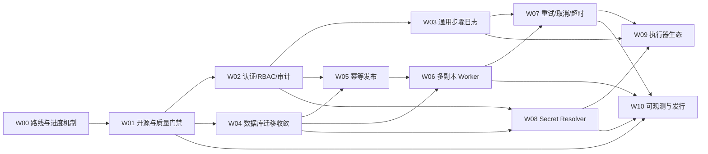

# Ares 开源化与生产能力开发计划

> - 文档类型：持续更新的开发路线与进度看板
> - 当前状态：W00 开发中，W01 等待许可证决策
> - 基线版本：`main@707ea6c`，已合并 [PR #4：可插拔 CI/CD 流程与动态环境](https://github.com/go-ree/ares/pull/4)
> - 最后更新：2026-09-03

本文承接 [可插拔 CI/CD 实施路线](pluggable-cicd-roadmap.md)。上一阶段已经完成动态环境、版本化工作流、通用串行编排和 Jenkins Adapter 的主链路；本计划负责把 Ares 从“可运行的开源 CI/CD 基础”推进到“可安全公开部署、可持续扩展、可进行生产化验证”的状态。

## 1. 使用方式

本文件同时承担路线图、进度看板和阶段验收清单三个职责。后续开发以工作包 `W01`～`W10` 为单位推进，每个工作包原则上对应一个可独立合并、可独立回退的中文 PR。

### 1.1 状态定义

| 状态     | 含义                                                 |
| -------- | ---------------------------------------------------- |
| `未开始` | 范围已经确定，尚未创建开发分支                       |
| `设计中` | 正在补充架构决策、接口契约、迁移或威胁模型           |
| `开发中` | 文档边界已确定，正在实现和测试                       |
| `待验收` | 实现和自动化验证已完成，PR 正在评审                  |
| `已完成` | 完成定义已满足；关联 PR 的实时合并状态以 GitHub 为准 |
| `阻塞`   | 存在必须由维护者或外部条件解除的阻塞项               |

### 1.2 强制同步规则

每个开发 PR 都必须修改本文件，并遵循以下顺序：

1. 开始开发时，将对应工作包改为 `设计中` 或 `开发中`，补充实际范围和新增决策。
2. 实现过程中，持续更新阶段清单；不得把尚未验证的事项标记为完成。
3. 创建 PR 后，填写关联 PR 链接、验证证据、遗留问题和必要的升级说明。
4. 进入评审前，将状态更新为 `待验收`；只有完成定义全部满足后才能更新为 `已完成`。
5. 若 PR 合并后文档状态仍未反映主线事实，下一个开发 PR 必须先校准状态再增加新内容。
6. 范围、顺序或架构边界发生变化时，先更新本文的决策记录，再修改生产代码。

PR 描述至少包含：目标、范围、非目标、数据库影响、安全影响、兼容/回退方式、测试结果和本文对应的工作包编号。

## 2. 总体目标与边界

### 2.1 已完成基线

- 应用仍是核心聚合根，每个 AppConfig 表示应用在一个动态环境中的配置。
- AppConfig 可以绑定自己的不可变工作流版本，不同环境可以使用不同步骤组合。
- 工作流步骤通过版本化 `uses` 和 Executor Registry 注册，不由发布核心硬编码。
- `builtin.noop@v1` 无外部依赖；`jenkins.job@v1` 是可选 Adapter。
- Jenkins、Kubernetes、Redis 和 RabbitMQ 都不是 Ares 启动的强制依赖。
- v2 任务原子保存流程、输入和步骤快照，并由通用 Worker 串行推进。
- 环境可以新增、排序、启停，不再限制为三套固定环境。
- 空库可以生成动态环境、应用配置、工作流和任务 Demo 数据。

### 2.2 当前主要缺口

- 当前登录身份来自浏览器本地数据，尚不能作为公开部署的身份与权限边界。
- v2 任务日志尚未通过通用步骤能力读取，前端仍保留固定 CI/CD 的 Jenkins 日志兼容逻辑。
- 存量表仍可能经过 Xorm 结构同步，结构变更尚未完全收敛到版本化迁移。
- 发布接口尚无客户端幂等键和统一预检，重复请求可能创建不同任务。
- Worker 只有步骤认领 CAS，没有完整 owner、lease、fencing 和多副本公平调度。
- `attempt`、超时基础字段已经存在，但尚无完整重试、退避、取消与尝试历史。
- 工作流能够拒绝常见敏感字段，但还不能安全解析版本化 Secret 引用。
- 执行器契约测试、可观测性、正式镜像发行与生产部署示例尚未闭环。

### 2.3 不变约束

- 不重新把 Jenkins 或任何单一平台写回发布核心。
- 不提供可执行任意 Shell 的通用步骤。
- 不要求用户必须部署 Redis、RabbitMQ、Jenkins 或 Kubernetes。
- 不用旧镜像直接连接不兼容的升级后可写数据库作为回退方案。
- 不在工作流、任务快照、日志、错误、指标或接口响应中保存/返回明文 Secret。
- 不直接向 `main` 推送开发变更；所有阶段通过中文 PR 评审与合并。

## 3. 总进度看板

| 工作包 | 主题                         | 依赖               | 状态     | 关联 PR | 主要交付结果                                    |
| ------ | ---------------------------- | ------------------ | -------- | ------- | ----------------------------------------------- |
| W00    | 后续路线与进度机制           | PR #4              | `开发中` | 待创建  | 建立本计划、状态口径和验收规则                  |
| W01    | 开源工程与质量门禁           | W00                | `阻塞`   | 待创建  | 开源治理文件、Required Checks、依赖与供应链基线 |
| W02    | 认证、RBAC 与审计            | W01                | `未开始` | 待创建  | 可信身份、服务端授权、真实发布人和审计记录      |
| W03    | 通用步骤日志                 | W02                | `未开始` | 待创建  | 通过 `task_id + step_key` 读取任意执行器日志    |
| W04    | 数据库迁移机制收敛           | W01                | `未开始` | 待创建  | 存量结构只由版本化 migration 改变               |
| W05    | AppConfig 核心的幂等发布     | W02、W04           | `未开始` | 待创建  | 预检、`config_id` 发布、`Idempotency-Key`       |
| W06    | 多副本 Worker 与租约         | W04、W05           | `未开始` | 待创建  | 公平领取、lease、fencing、故障接管              |
| W07    | 重试、取消、超时与尝试历史   | W03、W06           | `未开始` | 待创建  | 可控的失败恢复和执行器取消能力                  |
| W08    | Secret Resolver 与密钥轮换   | W02、W04           | `未开始` | 待创建  | 工作流只保存 Secret 引用，运行时按版本解析      |
| W09    | 执行器开发套件与扩展生态     | W03、W07、W08      | `未开始` | 待创建  | 契约测试、模板及新增执行器                      |
| W10    | 可观测性、正式发行与生产示例 | W01、W06、W07、W08 | `未开始` | 待创建  | 指标、告警、签名镜像、生产部署与升级工具        |

依赖关系如下：

W02 与 W04 在 W01 完成后可以并行设计，但涉及同一数据库迁移或公共 API 时仍需按顺序合并。W09 不早于日志、可靠性和 Secret 契约稳定，避免为每个新平台重复返工。

## 4. 工作包明细

### W00：后续路线与进度机制

目标：把后续范围、依赖、状态、决策和验收方式统一落到仓库文档中，作为维护者与开发者之间的进度事实源。

范围：

- [x] 记录 PR #4 后的已完成基线和已知缺口。
- [x] 拆分 W01～W10，明确依赖、范围、非目标和完成定义。
- [x] 建立文档状态、PR 同步、决策记录和风险看板规则。
- [x] 从文档首页和上一阶段路线图链接到本计划。

完成定义：

- 计划内容与 `main` 实际能力一致，内部相对链接和 Markdown 格式验证通过。
- 独立审阅未发现未解决的高优先级范围或依赖矛盾。
- 创建中文 PR 并填写总看板中的关联链接后，状态进入 `待验收`。

### W01：开源工程与质量门禁

目标：让后续每个高风险改动都有稳定、可复现的自动验收入口，并补齐公开协作的基本规则。

范围：

- [ ] 由维护者确认开源许可证并添加 `LICENSE`；当前建议 Apache-2.0。
- [ ] 添加 `CONTRIBUTING.md`、`SECURITY.md`、行为准则、Issue/PR 模板。
- [ ] 建立 GitHub Actions，至少运行 Go Test、Vet、重点 Race、govulncheck、前端 Lint/Prettier/Type Check/Build、Compose 校验和镜像构建。
- [ ] 配置依赖自动更新和缓存策略，固定 CI 使用的 Go、Node、npm 与工具版本。
- [ ] 处理可达 Go 漏洞和前端 high/critical 开发依赖；无法立即处理的项必须有带期限的豁免说明。
- [ ] 清理 Makefile 中的旧项目名、旧版本和失效镜像路径。
- [ ] 为发布镜像生成 SBOM，并增加容器镜像漏洞扫描。

非目标：本工作包不改变发布领域模型、任务状态机和运行时部署依赖。

完成定义：

- 干净 checkout 可以仅按文档执行全部质量检查。
- Required Checks 阻止失败的测试、构建或高危安全检查进入 `main`。
- Go 可达漏洞为 0；完整 npm 依赖无未豁免的 high/critical。
- Compose 镜像构建成功，SBOM 可下载，扫描结果随 PR 留档。

### W02：认证、RBAC 与审计

目标：建立公开部署所需的可信身份和最小权限边界。

范围：

- [ ] 先形成身份与权限 ADR；默认方案为 OIDC，并提供首次部署的本地 bootstrap 管理员。
- [ ] 定义 `viewer`、`developer`、`releaser`、`admin` 的权限矩阵。
- [ ] 为应用、AppConfig、域名、工作流、发布、任务、日志、Kubernetes 和系统设置路由统一接入鉴权中间件。
- [ ] 发布人、配置修改人和审计主体由服务端认证信息生成，不接受客户端冒充。
- [ ] 建立只增的审计事件，记录主体、动作、资源、结果、request ID 和时间，不记录敏感请求正文。
- [ ] 替换前端本地伪登录，按服务端会话和权限显示菜单/按钮。
- [ ] 明确 SSE/流式接口的安全传输方案，优先同源 HttpOnly Cookie 或短时一次性流令牌。
- [ ] OIDC 严格校验签名、issuer、audience、`state`、`nonce` 和 PKCE，并限制时钟偏差与回调地址。
- [ ] Cookie 会话启用 Secure、HttpOnly、SameSite，防止会话固定；Cookie 鉴权的写请求必须校验 CSRF。
- [ ] 支持会话过期、服务端撤销和完整登出；bootstrap 凭据首次使用后必须关闭或显式轮换。
- [ ] 所有接收 JSON 请求体的 API（包括 POST 查询）统一使用严格解码和请求体上限，避免未知字段误用和超大请求占用资源。
- [ ] HTTP Server 配置 Header/Read/Idle 超时，普通 API 使用有限 WriteTimeout；SSE 使用路由级写入期限、心跳、空闲超时和 cursor 续传，不能被普通 API 的全局 WriteTimeout 意外截断。
- [ ] 将 `X-Ares-Admin-Token` 标记为过渡兼容方案并给出弃用路径。

非目标：首版不实现复杂的应用级自定义角色和外部策略引擎。

完成定义：

- 匿名访问受保护资源返回 401，越权访问返回 403。
- 普通用户不能修改环境、集成或工作流；只有发布角色可以创建任务。
- 修改请求中的 `publisher` 不能改变审计主体。
- OIDC 回调的伪造 `state`/`nonce`、错误 issuer/audience、无效 PKCE 和会话固定攻击均被自动化测试拒绝。
- Cookie 写请求缺少或伪造 CSRF 令牌时返回 403；登出或撤销后原会话立即失效。
- bootstrap 初始化只能完成一次，默认配置不能在首次初始化后继续创建管理员。
- 所有 JSON 请求中的未知字段稳定返回 400，超出限制的请求体返回 413，慢请求和未完成 Header 在配置超时内被释放。
- 日志流持续超过普通 API WriteTimeout 时仍能连续读取，或断线后通过 cursor 无损续传。
- 登录失效后日志流不会无限重连，敏感字段不会进入审计日志。
- 鉴权矩阵拥有后端集成测试和前端关键路径测试。

### W03：通用步骤日志

目标：完成 Jenkins 解耦的最后一段主链路，让日志成为执行器可选能力而不是 Jenkins 专用接口。

范围：

- [ ] 新增经过鉴权的 `task_id + step_key + cursor` 日志 API 或 SSE。
- [ ] 服务端从任务步骤快照读取 `uses` 和 opaque `external_ref`，再通过 Registry 分派 `LogReader`。
- [ ] `jenkins.job@v1` 实现 `LogReader` 并声明日志能力；客户端不能提交 Job、Build ID 或 Jenkins 地址。
- [ ] Noop 等不支持日志的执行器返回明确能力结果，不伪造空日志。
- [ ] 前端按任意数量步骤展示日志，只有 `capabilities.logs=true` 时提供入口。
- [ ] 关闭详情或切换任务时立即释放流连接；断线从 cursor 续传。
- [ ] 旧 Jenkins CI/CD 日志路由标记 deprecated，仅保留 v1 历史任务只读兼容。

非目标：不在本阶段实现执行器取消、重试或通用制品浏览。

完成定义：

- v2 Jenkins folder Job 可以按具体步骤读取日志。
- 篡改 task/step 或跨权限访问不会读取其他任务日志。
- 地址或执行器实例不匹配时在外部网络请求前失败。
- 断线续传不重复、不丢失已确认日志，页面关闭后没有残留连接或 goroutine。
- [可插拔 CI/CD 实施路线](pluggable-cicd-roadmap.md) 的阶段 D 可以全部完成。

### W04：数据库迁移机制收敛

目标：让数据库升级成为显式、可审计、可验证的发布步骤，消除存量表被 ORM 隐式改变的风险。

范围：

- [ ] Xorm 只创建不存在的表；已存在表不再执行自动 ALTER/DROP。
- [ ] 把剩余字段、类型、索引、外键和字符集修复全部迁移到版本化 SQL migration。
- [ ] 提供独立的 `migrate status`、`migrate up` 和启动时只读兼容性检查。
- [ ] migration 记录增加 checksum、started/finished、dirty 状态和 schema 兼容范围。
- [ ] 生产运行账号不要求 DDL 权限，迁移使用独立授权账号或作业。
- [ ] 补齐 expand/contract、前向修复、备份恢复和中断恢复文档。

非目标：本阶段不删除旧业务表或旧发布字段；破坏性 contract 迁移另行评审。

完成定义：

- 空库、上一正式版数据库、重复启动、迁移中断和两个 migrator 并发均有自动化或 Compose/MySQL 8 实测。
- 第二次应用启动不再对存量表执行结构 DDL。
- 仅修改 Go entity 不会静默改变生产表。
- dirty migration 阻止不兼容应用启动，并给出可操作的恢复说明。

### W05：AppConfig 核心的幂等发布

目标：将发布入口与领域模型对齐，并让浏览器重试、网关重试和重复点击只创建一个任务。

范围：

- [ ] 新增以 `config_id + ref + inputs` 为核心的发布 API。
- [ ] 支持 `Idempotency-Key`，保存作用域、规范化请求摘要和创建结果。
- [ ] 相同 key、相同请求返回原任务；相同 key、不同请求返回 409。
- [ ] 旧 `app_name + env` 接口改为兼容适配层并复用同一领域服务。
- [ ] 新增单个和批量发布预检，返回环境、AppConfig、工作流版本及步骤可用性。
- [ ] 合并重复的发布 UI；选择环境后展示可发布应用及不可发布原因。
- [ ] 批量发布逐项返回结果，进度基于真实步骤状态而不是固定 CI/CD 百分比。

非目标：不在本阶段增加自动审批、定时发布或跨应用 DAG。

完成定义：

- 20～100 个并发相同请求只产生一个任务和一组步骤快照。
- 服务重启后重放相同 key 仍返回原任务，异参稳定返回 409。
- Jenkins 未配置时 Jenkins 流程预检失败，但 Noop 流程仍可发布。
- 禁用环境、无 AppConfig、无流程和执行器不可用时不留下半成品任务。

### W06：多副本 Worker 与租约

目标：支持多个 Ares 实例安全、均衡地推进 v2 任务，并在实例故障后自动接管。

范围：

- [ ] 增加 `next_poll_at`、`lease_owner`、`lease_expires_at` 和单调 fencing token。
- [ ] 领取、续租、保存结果、释放和终止操作全部校验 lease/fencing。
- [ ] running 步骤的 Reconcile 也必须持有有效租约。
- [ ] 实现公平到期扫描、退避与 jitter，移除通过更新 `updated_at` 轮转的临时策略。
- [ ] Worker 生命周期接入进程 context，支持 graceful drain。
- [ ] lease 续约失败时尽力取消当前本地执行 context，但不假设已经发出的外部请求一定可以被撤销。
- [ ] 多实例的集成配置通过数据库 revision/CAS 自动收敛。
- [ ] v1 遗留任务在排空前继续维持单副本或独立 leader 约束。

非目标：Ares 不能单方面承诺跨外部系统 exactly-once。lease 只能协调唯一有效所有权并阻止陈旧数据库写入，不能强制停止租约失效前已经发出的外部调用，也不能消除“外部请求成功、引用落库前进程崩溃”的不确定窗口；外部调用可能并发或重放，执行器仍必须配合稳定幂等键。

完成定义：

- 至少 3 个 Worker 并发时，数据库中任一时刻只有一个未过期的合法 lease；只有当前 fencing token 可以提交结果，陈旧持有者的写入被拒绝。
- 随机 kill/restart 后租约可以到期接管，陈旧 Worker 无法覆盖新结果。
- 覆盖外部调用阻塞时间超过租期的故障测试，并明确观察到调用可能重叠或重放；幂等 Mock 执行器只能产生一个业务副作用。结果不明确时沿用安全失败策略，不在本阶段盲目自动重试。
- 任务数量超过单批扫描上限时不会饥饿。
- 集成临时不可用时不会形成高频空转或请求风暴。

### W07：重试、取消、超时与尝试历史

目标：让失败恢复和人工中止成为状态机的一部分，而不是前端按钮或临时字段。

范围：

- [ ] 为步骤规范增加有限重试、退避、可重试错误类型和超时策略。
- [ ] 建立 attempt 历史记录；每次尝试拥有独立状态、时间、外部引用和稳定幂等键。
- [ ] 增加 `retry_wait`、`timed_out` 等明确状态及合法状态转换。
- [ ] 实现任务取消 API 和执行器 `Canceller`；Jenkins Adapter 支持安全取消 Queue/Build。
- [ ] 区分“明确未产生副作用”“已有外部引用”和“请求结果不明确”，禁止不安全自动重试。
- [ ] 前端按执行器能力和任务状态展示取消/重试入口，并显示尝试历史。

非目标：不实现任意历史节点回放或自动修改工作流后重跑旧任务。

完成定义：

- 并发取消或重试不会创建重复外部任务。
- queued、running 和终态任务的取消语义稳定且幂等。
- 重试次数、退避时间和 attempt 历史在重启后保持正确。
- 不支持取消的执行器不会在前端出现虚假按钮。
- 超时和外部结果不明确时进入可诊断的确定状态。

### W08：Secret Resolver 与密钥轮换

目标：让工作流能够安全引用凭据，同时保证任务、日志和数据库中不出现解析后的明文。

范围：

- [ ] 定义稳定的 `SecretResolver` / `SecretProvider` 接口和 `secret://` URI。
- [ ] 首批支持数据库加密 Secret、环境变量和只读文件；Vault/Kubernetes Secret 留作 Adapter。
- [ ] 工作流保存 Secret 引用；任务快照固定引用版本，不保存解析值。
- [ ] 执行步骤前即时解析，通过独立只读访问器提供给执行器，不混入普通 config/output。
- [ ] 密文格式增加 key ID、版本和 AAD，支持旧钥解密、新主钥加密与在线 rewrap。
- [ ] Web/API 只允许写入或替换 Secret，永不回显明文，并记录审计事件。

非目标：不自研完整的企业密钥管理系统；外部 Secret 平台通过 Provider 扩展。

完成定义：

- 数据库、任务快照、API、日志、错误、指标和 Trace 扫描不到测试明文 Secret。
- 旧密文可以迁移，新旧密钥共存期间任务正常运行。
- 在途任务固定 Secret 版本，轮换不会把同一次执行切换到不同凭据。
- 敏感键和嵌套输入拥有 fuzz/错误注入测试。

### W09：执行器开发套件与扩展生态

目标：让社区能够按稳定契约增加步骤，而不复制 Ares 内部实现或绕过安全边界。

范围：

- [ ] 提供执行器脚手架、最小示例和可复用 conformance suite。
- [ ] 契约测试覆盖 Validate、Start/Reconcile、context、幂等、日志、取消、Secret、敏感输出和错误分类。
- [ ] 定义执行器版本兼容、弃用和升级策略。
- [ ] 分别评审 GitHub Actions、Webhook、Kubernetes 原生发布执行器；每个执行器独立 PR。
- [ ] 通知使用独立接口；默认可采用 MySQL 轮询，Redis/RabbitMQ 只作为可选 Adapter/Profile。
- [ ] 工作流编辑器根据 `config_schema` 生成基础表单，同时保留专家 JSON 模式、版本差异和跨环境复制。

非目标：不允许第三方执行器绕过权限、Secret、审计或任务快照边界。

完成定义：

- 新增一个示例执行器不需要修改发布核心和发布工作台核心逻辑。
- conformance suite 可以验证同步、异步、日志和取消能力组合。
- 禁用任何第三方执行器或中间件后，Ares 核心与 Noop 仍可运行。
- 工作流历史任务仍绑定原版本和原步骤快照。

### W10：可观测性、正式发行与生产示例

目标：让维护者能判断系统是否健康、能安全升级，并获得可验证的正式发布产物。

范围：

- [ ] 增加队列时延、步骤耗时、失败率、lease、重试、执行器调用、集成状态、migration 和 DB pool 指标。
- [ ] 结构化日志统一携带 request ID、task ID、step key、attempt 和 owner；禁止敏感值与高基数指标标签。
- [ ] 提供可选 OTLP Trace，以及 Prometheus/Grafana Compose Profile、仪表盘和告警规则。
- [ ] 发布不可变 SemVer、多架构 GHCR 镜像，附 SBOM、签名和 provenance。
- [ ] 保留当前 Compose 作为 loopback Demo，另提供无 Demo、无默认密码、支持 secrets/`*_FILE` 的生产示例。
- [ ] 增加 `ares doctor`、升级前检查、schema 兼容矩阵、备份恢复演练和版本发布说明。

非目标：在 W02、W04、W06、W07 和 W08 完成前，不宣称公网生产部署或多副本生产就绪。

完成定义：

- 故障注入能够触发任务积压、步骤卡死、租约失效、集成断连和迁移失败告警。
- 生产示例默认安全，不包含默认密码、不启用 Demo、不公开内部指标端口。
- 镜像可以验证签名、SBOM 和来源，升级检查能在变更数据库前报告阻塞项。
- 发布说明明确升级、前向修复和备份恢复路径。

## 5. 跨阶段测试矩阵

所有工作包除自己的完成定义外，还要维持已经交付能力的回归基线。尚未到达生效工作包的未来能力不作为前序工作包的完成条件。

| 类别   | 生效阶段 | 必须验证                                                                               |
| ------ | -------- | -------------------------------------------------------------------------------------- |
| Go     | W00 起   | `go test -count=1 ./...`、`go vet ./...`，并对并发/运行时包执行 Race Detector          |
| 前端   | W00 起   | ESLint、Prettier、TypeScript 类型检查、生产构建；W01 后增加单元与 Compose E2E          |
| API    | W00 起   | 维持当前已交付接口的状态码与敏感字段策略；严格未知字段、请求体上限和 401/403 自 W02 起 |
| 数据库 | W00 起   | 当前迁移的空库、升级和重复启动；完整中断/并发恢复矩阵自 W04 起                         |
| 安全   | W01 起   | 依赖漏洞；鉴权/越权自 W02 起；通用日志自 W03 起；Secret 全链路自 W08 起                |
| 部署   | W00 起   | 不配置 Jenkins/Kubernetes/Redis/RabbitMQ 时核心健康；生产配置自 W10 起                 |
| 兼容   | W00 起   | v1 历史只读和安全收尾，v2 任务不被旧状态机重复执行                                     |

## 6. 决策记录

| 编号  | 决策               | 状态     | 结论或建议                                                                 | 影响工作包    |
| ----- | ------------------ | -------- | -------------------------------------------------------------------------- | ------------- |
| D-001 | 开源许可证         | `待确认` | 建议 Apache-2.0，由维护者最终确认                                          | W01           |
| D-002 | 首个正式身份源     | `待设计` | 建议 OIDC + 本地 bootstrap 管理员                                          | W02           |
| D-003 | 流式日志认证       | `待设计` | 建议同源 HttpOnly Cookie 或短时一次性流令牌                                | W02、W03      |
| D-004 | migration 运行模式 | `待设计` | 建议独立 migrator，应用启动仅做兼容性检查                                  | W04           |
| D-005 | 多副本交付语义     | `待固化` | Ares 提供 at-least-once；执行器必须配合幂等键，lease 使用 fencing 防陈旧写 | W05、W06、W07 |
| D-006 | 中间件策略         | `待固化` | 默认不依赖 Redis/RabbitMQ；通知与队列能力通过可选 Adapter 扩展             | W09、W10      |

每项架构决策形成 ADR 后，在本表补充文档链接并将状态更新为 `已确定`。若推翻既有结论，必须新增决策记录，不覆盖历史原因。

## 7. 风险看板

| 编号  | 风险                                     | 当前等级 | 缓解计划                                                     | 状态 |
| ----- | ---------------------------------------- | -------- | ------------------------------------------------------------ | ---- |
| R-001 | 浏览器身份可伪造，公开部署后缺少权限边界 | 高       | W02 建立真实认证、RBAC 与审计；完成前仅用于本地或受信网络    | 开放 |
| R-002 | Xorm 可能隐式修改存量表结构              | 高       | W04 收敛为版本化迁移；升级前备份并禁止旧镜像写升级库         | 开放 |
| R-003 | 多副本会重复 Reconcile running 步骤      | 高       | W06 引入 lease 和 fencing；完成前整个 Ares Worker 保持单副本 | 开放 |
| R-004 | v2 日志仍依赖 Jenkins 兼容字段           | 中       | W03 改为执行器通用日志能力                                   | 开放 |
| R-005 | 重试请求可能重复创建发布任务             | 中       | W05 引入 `Idempotency-Key` 和请求摘要                        | 开放 |
| R-006 | 工作流不能安全消费 Secret                | 中       | W08 上线前继续拒绝敏感字段，不允许保存明文凭据               | 开放 |
| R-007 | 开发/构建依赖存在已知漏洞或版本漂移      | 中       | W01 固定工具链、升级依赖并建立自动扫描                       | 开放 |

风险关闭时必须填写验证证据或关联 PR；降低等级必须说明依据。

## 8. 下一步

W00 正在通过文档 PR 交付。W01 的许可证子项被 D-001 阻塞；若维护者确认 Apache-2.0，下一开发 PR 从 W01 开始，并先把 W00 校准为 `已完成`、W01 更新为 `开发中`，再提交治理文件、CI、依赖升级和供应链检查。W01 进入稳定状态后，W02 与 W04 可以分别开始设计。
